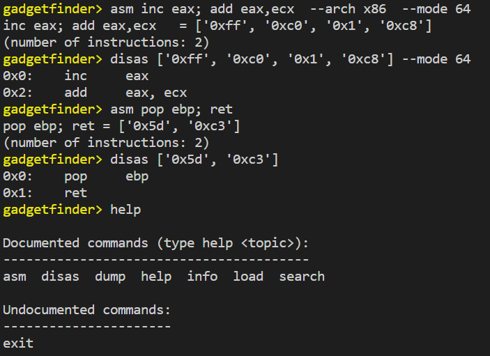
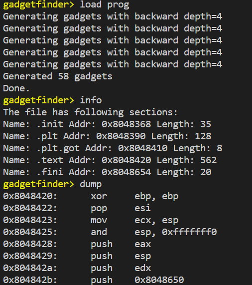
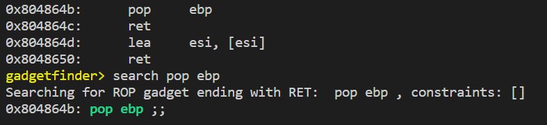
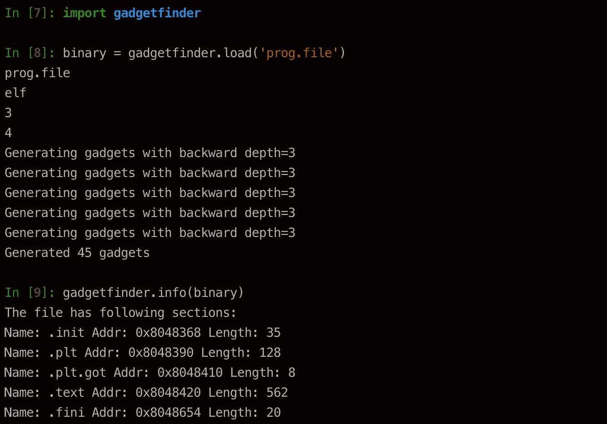
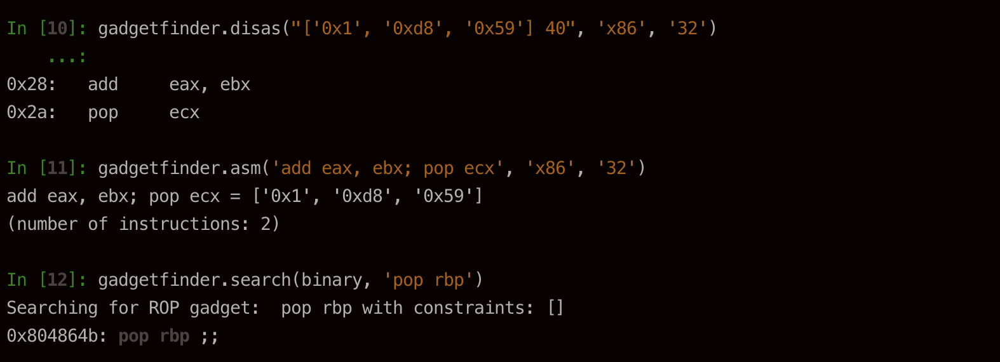

# GadgetFinder
A tool with interactive shell for finding gadgets in executable files. 
Support ELF and PE file format, multiple architectures and modes: x86, ARM, 32bit, 64 bit.
Can also assemble and disassemble instructions.


## Requirements
+ capstone
+ keystone
+ pyelftools
+ pefile

## Getting started
create a virtualenv:
```bash
virtualenv env            
source env/bin/activate   # activate the Python virtualenv 
```

Install development dependencies:
```bash
pip install -r requirements.txt
```

Run the interactive shell:
```bash
cd src/gadgetfinder
python3 shell.py
```

## Examples
In the interactive shell, run:
```bash
asm inc eax; add eax,ecx  --arch x86  --mode 64
disas ['0xff', '0xc0', '0x1', '0xc8'] --mode 64
asm pop ebp; ret
disas ['0x5d', '0xc3']
```


```bash
load ../../data/prog.file 
info
dump
```



```bash
search pop ebp
```



## Build your own package
You can edit configuration in setup.config.\
To build:
```bash
python3 -m pip install --upgrade pip
python3 -m pip install --upgrade build
python3 -m build
```

## Package usage
### Installation
```
$ pip install gadgetfinder==0.0.1
```

### Usage





## Known issue
Unable to find some gadget